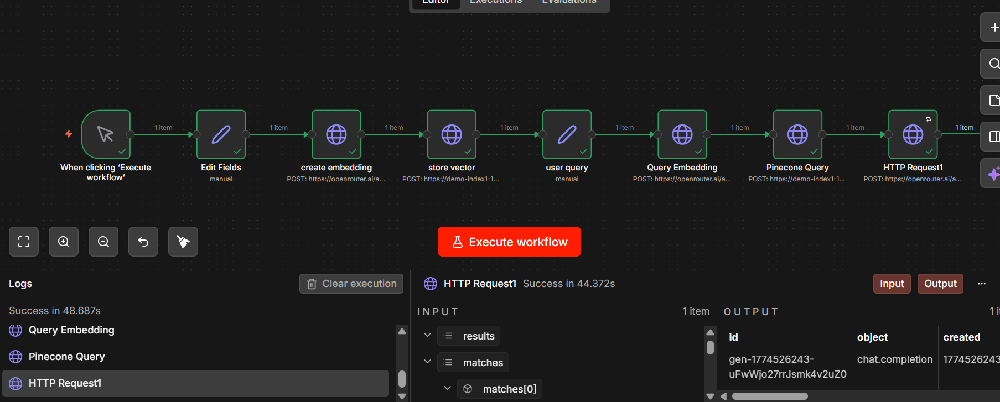

# rag-semantic-search-pinecone-openrouter
Built a Retrieval-Augmented Generation (RAG) system using OpenRouter, Pinecone, and vector embeddings to enable semantic search and AI-powered question answering.

**This project demonstrates real-world implementation of RAG architecture used in modern AI systems like ChatGPT plugins and enterprise search solutions.**
 
 
**🚀 RAG-Based Semantic Search System**
 
**📌 Overview**
 
This project implements a Retrieval-Augmented Generation (RAG) system that combines vector search with AI generation to provide accurate, context-aware answers.
 
It uses embeddings to store and retrieve semantic meaning from data, enabling intelligent question answering beyond keyword matching.
 
---
 
**🧠 Architecture**
 
User Query → Embedding → Vector Search → Context Retrieval → AI Response
 
---
 
**⚙️ Tech Stack**
 
- OpenRouter (for embeddings & LLM)
- Pinecone (vector database)
- n8n (workflow automation)
- REST APIs
 
---
 
**🔄 Workflow Explanation**
 
1. Data Ingestion
 
- Input text is provided using Edit Fields node
- Example:
  - "Vector database is used for semantic search"
 
2. Embedding Creation
 
- Text is converted into vector embeddings using OpenRouter API
 
3. Vector Storage
 
- Embeddings are stored in Pinecone along with metadata
 
---
 
4. Query Processing
 
- User query is converted into embedding
- Example:
  - "What is vector database?"
 
---
 
5. Semantic Retrieval
 
- Pinecone retrieves topK most similar vectors
- Based on cosine similarity
 
---
 
6. Context Augmentation
 
- Retrieved text is added as context to the prompt
 
---
 
7. Response Generation
 
- OpenRouter LLM generates final answer using context
 
---
 
**🔥 Key Features**
 
- Semantic search using vector embeddings
- Real-time AI-powered responses
- Context-aware answering (RAG architecture)
- Scalable vector storage with Pinecone
- Modular workflow using n8n
 
---
 
📊 Example
 
Query:
"What is vector database?"
 
Retrieved Context:
"Vector database is used for semantic search"
 
Generated Answer:
"A vector database is a system designed to store and search embeddings..."
 
---
 
🧩 Concepts Used
 
- Embeddings
- Cosine Similarity
- Vector Databases
- Retrieval-Augmented Generation (RAG)
- Prompt Engineering
 
---
 
🚀 Future Improvements
 
- Add multiple documents for richer context
- Implement similarity threshold filtering
- Build frontend chatbot UI
- Add memory for conversational AI
 
---
 
**👩‍💻 Author
 
Nirupama S**
 
---
 
**⭐ If you like this project, give it a star!**
 
 
 
 

 
 
 

 
